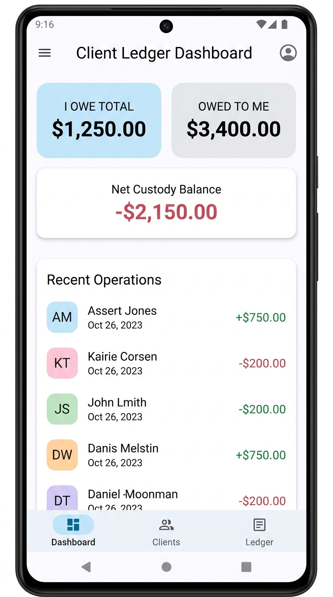
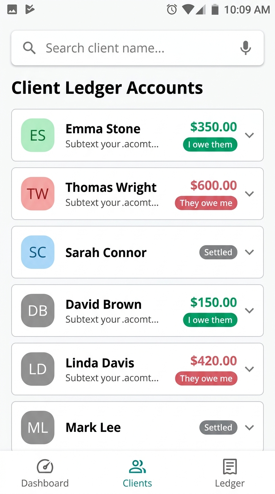

# Client Ledger

A modern, offline-first personal ledger and client account manager built natively for Android using Jetpack Compose and Material Design 3. Designed for freelancers, small business owners, and local shops, **Client Ledger** allows you to visually track, search, and organize outstanding balances with custom transaction records, instant contact actions, and secure local data.

---

## 📱 Application Screenshots

  
  

---

## ✨ Key Benefits & Features

*   **Financial Summaries at a Glance**: Instantly view your modern slate-themed headers tracking overall outstanding metrics—clearly separating **Amounts Owed by Me** (credits) from **Amounts Owed to Me** (debits).
*   **Intuitive Visual Indicators**: Uses modern, readable color-coded accents for quick balance scanning:
    *   💚 **Emerald Details** (`#065F46`) represent settled accounts, income streams, or active store credits.
    *   ❤️ **Rose Details** (`#9F1239`) represent active balances, due debits, or outgoing transactions.
*   **Dynamic Avatar initials**: Automatically generates high-contrast avatar badges from client names for modern visual styling.
*   **Instant Client Contact**: Call or email clients directly from their profile with integrated single-tap action handlers.
*   **Receipt Attachments**: Link and preview offline visual image documents, bills, or receipt forms directly inside item transaction cards.

---

## 📦 How to Get the App (APK)

Installing **Client Ledger** on your Android device is simple and takes less than a minute.

### The Quickest Way (Recommended)

1.  Open this repository page on your phone or web browser.
2.  On the right-hand panel, locate and tap on the **Releases** section (or click **v1.0.1**).
3.  Under the **Assets** list, tap directly on the **`app-debug.apk`** download package.
4.  Once downloaded, open the file on your Android device to install the app!

---

## 🛡️ Privacy & Reliability

*   **100% Offline-First**: All ledger details, balances, dates, contact details, and receipt previews are stored locally on your device. Your data never leaves your custody.
*   **High Performance**: Restructures and queries databases smoothly with zero loading delay.
*   **Material Design 3 (M3)**: Beautiful light/dark system theming supporting all screen sizes, tablets, and foldables.
